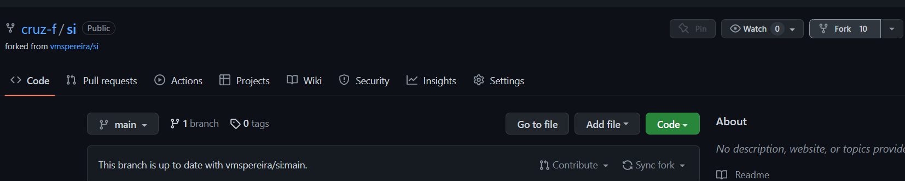

# Sistemas Inteligentes para Bioinformática

## Curricular Unit
Mestrado em Bioinformática, Universidade do Minho, 2022-2023.


## Description
A package of machine learning algorithms to grasp the concepts of the course.
Students should implement essential algorithms from scratch using numpy and pandas.
Implementations must follow a common and simple API.


## Setup
To get started, fork the repository from GitHub and clone it to your local machine.

Fork the following GitHub repository: https://github.com/cruz-f/si


Then, clone the repository to your local machine:
```bash
git clone https://github.com/YOUR_USERNAME/si.git
```

Open the repository in your favorite IDE and install the dependencies (if missing):
```bash
pip install -r requirements.txt
```
or
```bash
pip install numpy pandas scipy matplotlib
```
Note: You can also create a similar Python package and push it to your GitHub.

Make a change to the repository: Add your co-authorship to the _\_\_init\_\_.py_ file (within the si folder):
```python
__author__ = "YOUR_NAME" 
__credits__ = ["YOUR_NAME"]
__license__ = "Apache License 2.0"
__version__ = "0.0.1"
__maintainer__ = "YOUR_NAME"
__email__ = "YOUR_EMAIL"
```

Then, commit it to your local repository and publish it to your GitHub:
```bash
git add README.md
git commit -m "Adding my co-authorship to README.md file"
git push origin main
```
Note: you can also use the IDE Git tools.


## Architecture
The package is organized as follows:
```
si
├── src
│   ├── si
│   │   ├── __init__.py
│   │   ├── data
│   │   │   ├── __init__.py
├── datasets
│   ├── README.md
│   ├── ...
├── scripts
│   ├── README.md
│   ├── ...
├── ... (python package configuration files)
```

A tour to Python packages:
- The _src_ folder contains the source code of the package. It should contain an intermediate file 
called _si_ (the name of the package) and the modules of the package. All python packages and subpackages
must also contain a file called _\_\_init\_\_.py_.
- The _datasets_ folder contains the datasets used in the scripts.
- The _scripts_ folder contains the scripts used to test the package and include examples.

Note: It is also common to have a _tests_ folder to include the unit tests of the package. However,
we will not cover this topic in this course.

Note: A python package also contains many configuration files (e.g., _setup.py_, _requirements.txt_, etc.).


## Credits
This package is heavily inspired and adtaped from https://github.com/vmspereira/si.
